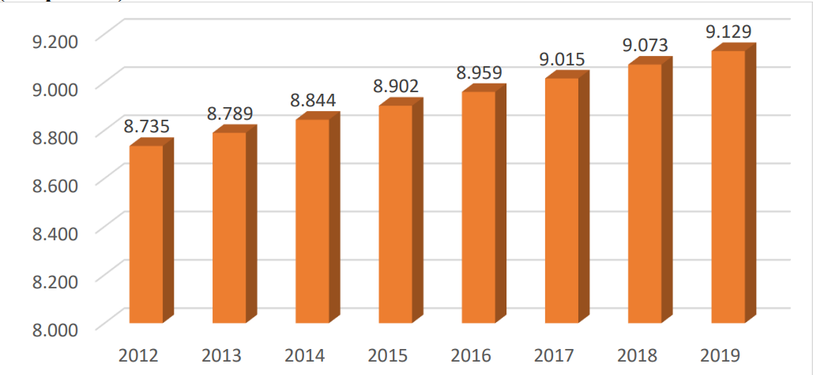
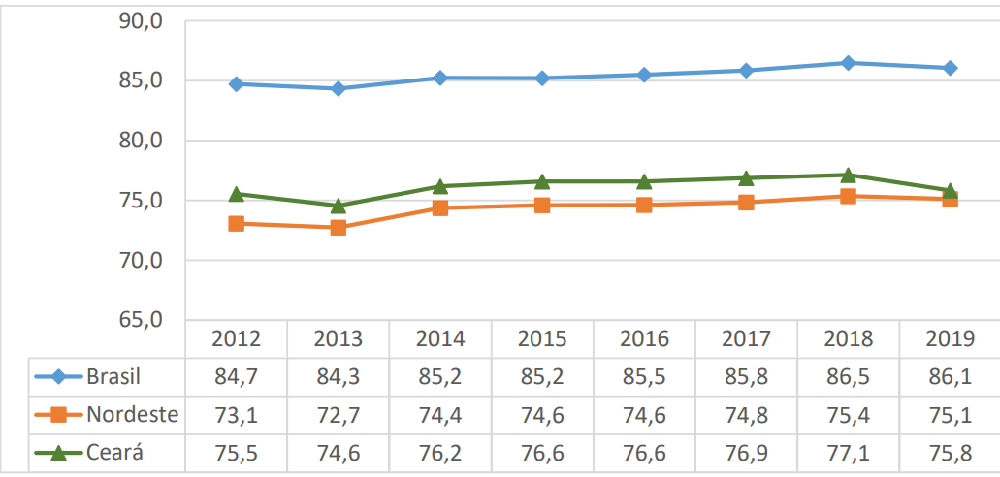
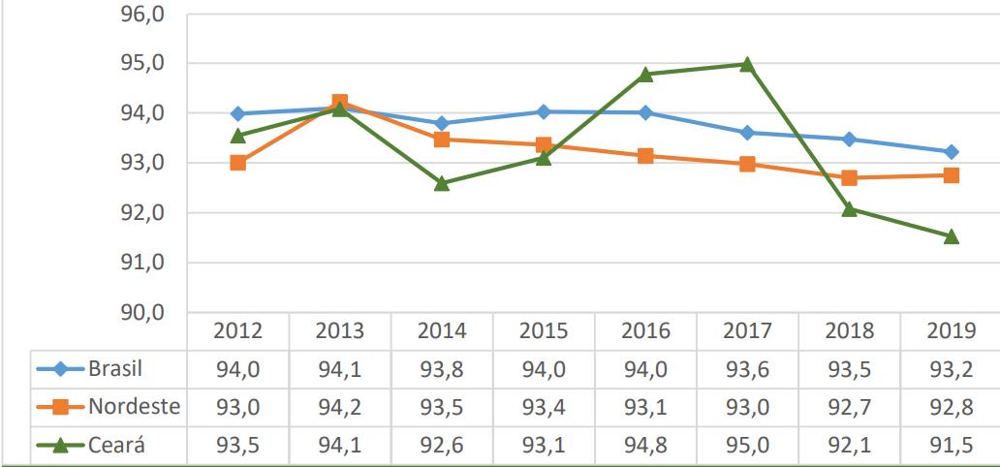
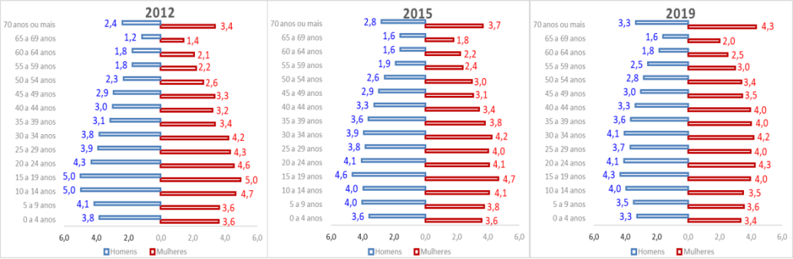
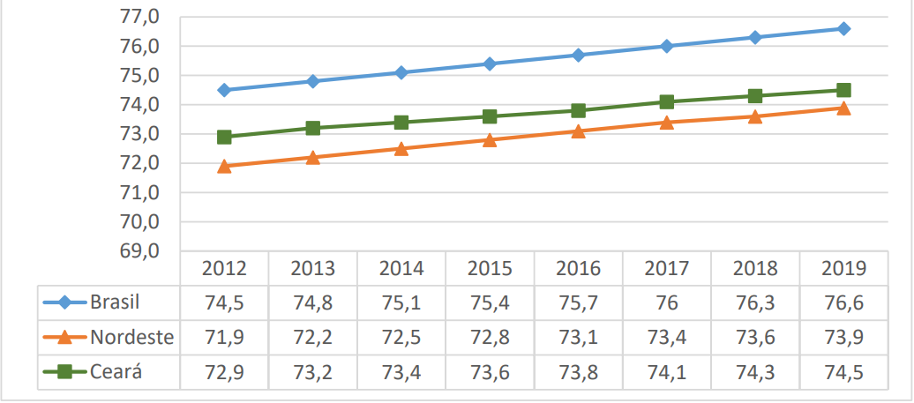
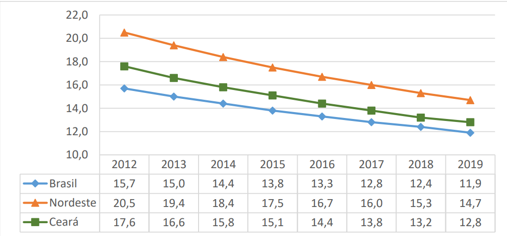
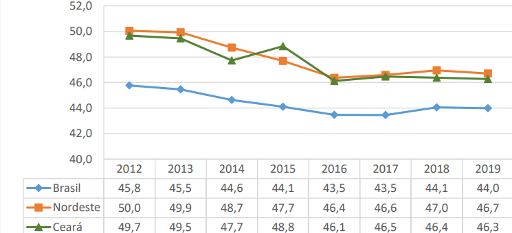
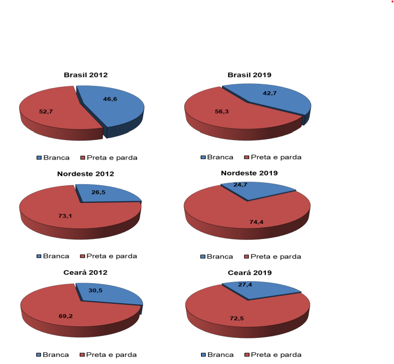

#  {.sidebar}

Este dashboard mostra dados da [PNAD Contínua](https://www.ibge.gov.br/estatisticas/sociais/saude/17270-pnad-continua.html) do [IBGE](https://www.ibge.gov.br/pt/inicio.html) para o estado do Ceará. 

Desenvolvido pela Diretoria de Estudos Sociais do [IPECE](https://www.ipece.ce.gov.br/)

 

::: {.callout-note collapse="true"}
## Notas

As variáveis relacionadas a rendimento estão defalcionadas de acordo com...

:::

# Demografia

## Column - População {width=50%}
### Row População total

### Urbanização

### Sexo

### Faixa etária

## Column {width=50%}

### Esperança de vida

### Mortalidade infantil

### Razão de dependência

### Raça

# Domicílios

## Média de moradores

## Tipo de domicílio

## Condição de ocupação

## Material

## Rede de esgotamento

## Rede de água

## Coleta de lixo

## Rede de energia elétrica

## Posse de bens

# Educação

# Mercado de trabalho